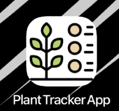
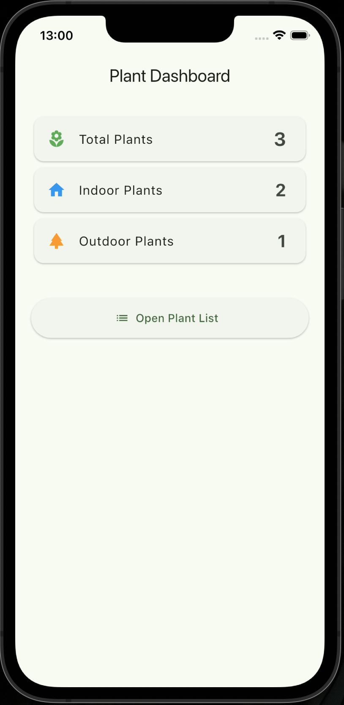

<<<<<<< HEAD
# plant_tracker_app

A new Flutter project.

## Getting Started

This project is a starting point for a Flutter application.

A few resources to get you started if this is your first Flutter project:

- [Lab: Write your first Flutter app](https://docs.flutter.dev/get-started/codelab)
- [Cookbook: Useful Flutter samples](https://docs.flutter.dev/cookbook)

For help getting started with Flutter development, view the
[online documentation](https://docs.flutter.dev/), which offers tutorials,
samples, guidance on mobile development, and a full API reference.

สรุประบบ Plant Tracker App (สั้น ๆ) 🌿
แอปพัฒนาด้วย Flutter ใช้ภาษา Dart
ใช้ SQLite เก็บข้อมูลต้นไม้ในเครื่อง
ใช้ Provider จัดการข้อมูลระหว่างหน้าจอกับฐานข้อมูล
ฟังก์ชันหลักของระบบ
เพิ่มข้อมูลต้นไม้ (Create)
ดูรายการต้นไม้ (Read)
แก้ไขข้อมูล (Update)
ลบข้อมูล (Delete)
หน้าหลักของแอป
Dashboard → แสดงจำนวนต้นไม้ทั้งหมด Indoor และ Outdoor
Plant List → แสดงรายการต้นไม้ทั้งหมด
Add/Edit Plant → เพิ่มหรือแก้ไขข้อมูลต้นไม้
Detail → ดูรายละเอียดต้นไม้

=======
# plant_tracker_app
>>>>>>> 7757e24227f11b259d59f183036bbf87c2a02688
